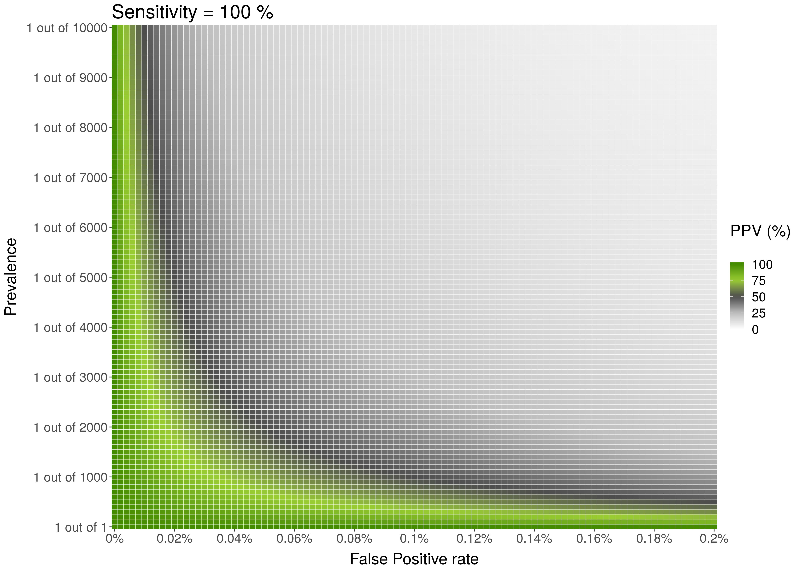
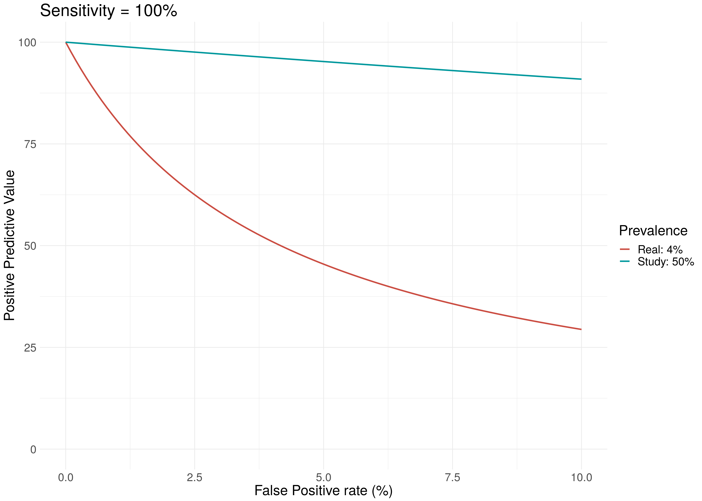

# R_PPV_Plot

This repository includes a few functions to help understand Positive Predictive Values, and their relationship with Sensitivity, Specificity and Prevalence.  

For example, PPV_Heatmap_FUN() can be used to plot the graphic below. The accepted parameters are:

* Max_Prevalence: Max prevalence in y axis. "1 out of Max_Prevalence"
* Sensitivity: Sensitivity of the test. 
* Max_FP: FP is 1 - specificity. The x axis will go from FP = 0% to Max_FP
* Language: "es" for Spanish or "en" for English  

`PPV_Heatmap_FUN(1000, 100, .2, Language = "en")`  

  

---   

To show a plot with the difference between the PPV of a study versus that of a real world screening context:  

`PPV_Study_vs_Real(Max_FP = 5, Sensitivity = 100, Prevalence_Real = 25, Prevalence_Study = 2)`  

