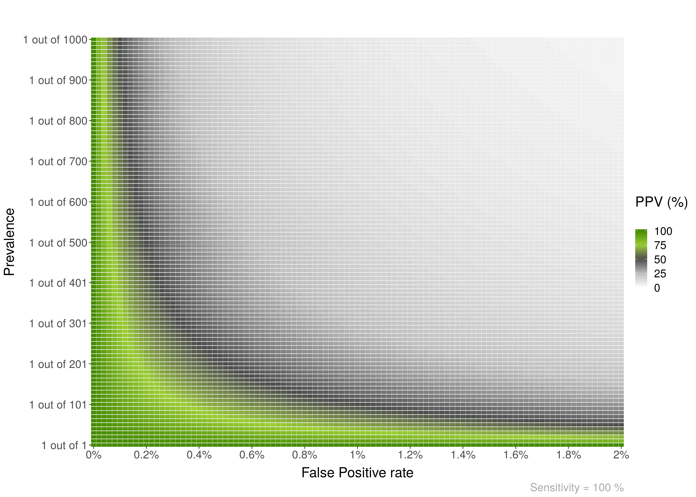
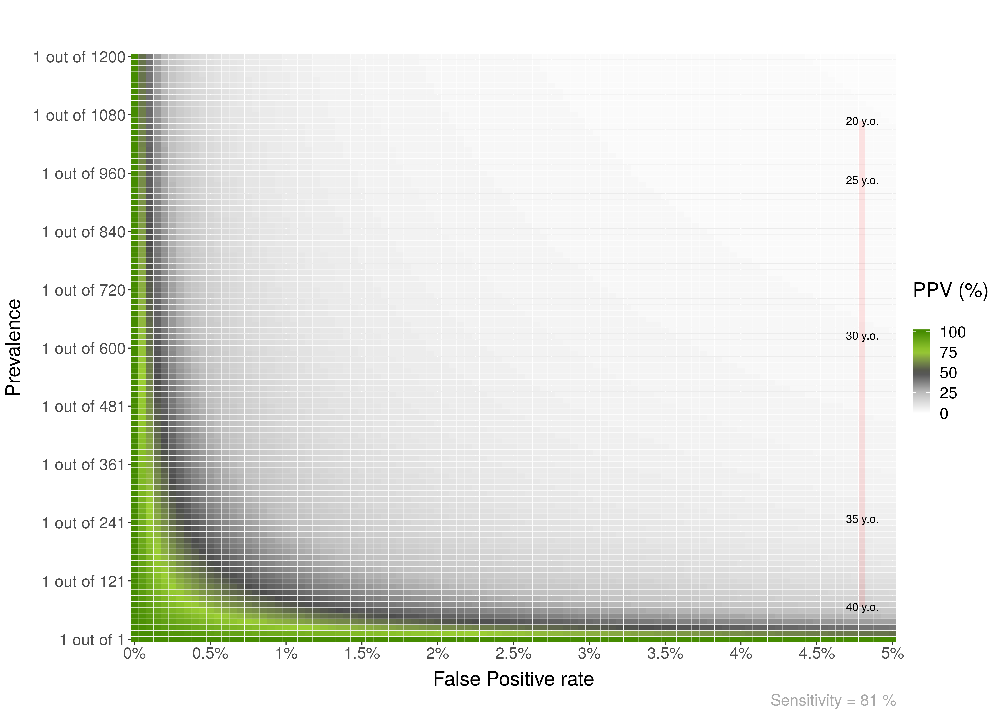

# Bayesian reasoning in medical contexts

This package includes a few functions to plot and help understand Positive Predictive Values, and their relationship with Sensitivity, Specificity and Prevalence.  

To install it you can do: `devtools::install_github("gorkang/R_PPV_Plot")`. Please report any problems you find in the [Issues Github page](https://github.com/gorkang/R_PPV_Plot/issues).


## PPV_heatmap()

Plot heatmaps with PPV values for a given specificity and a range of Prevalences and FP. The basic parameters are:

* Max_Prevalence: Max prevalence in y axis. "1 out of Max_Prevalence"
* Sensitivity: Sensitivity of the test. 
* Max_FP: FP is 1 - specificity. The x axis will go from FP = 0% to Max_FP
* Language: "es" for Spanish or "en" for English  


``` r 

PPV_heatmap(Max_Prevalence = 1000, 
            Sensitivity = 100, 
            Max_FP = 2, 
            Language = "en")
            
```  


  


--- 

You can add an overlay to the plots. For example:

``` r 

PPV_heatmap(Max_Prevalence = 1800, Sensitivity = 90, Max_FP = 15, 
                label_subtitle = "PPV of Mammogram for Breast Cancer by Age",
                save_plot = TRUE, Language = "en", 
                overlay = TRUE, 
                overlay_labels = c("80", "70", "60", "50", "40", "30", "20  y.o."),
                overlay_position_FP = c(6.5, 7, 8, 9, 12, 14, 14),
                overlay_position_Prevalence = c(22, 26, 29, 44, 69, 227, 1667))
                
```

  

---   

Another example. In this case, the FP is constant across age:

``` r 

PPV_heatmap(Max_Prevalence = 1200, Sensitivity = 81, Max_FP = 5,
           label_subtitle = "Prenatal screening for Down Syndrome by Age",
           save_plot = TRUE, Language = "en",
           overlay = TRUE,
           overlay_labels = c("40 y.o.", "35 y.o.", "30 y.o.", "25 y.o.", "20 y.o."),
           overlay_position_FP = c(4.8, 4.8, 4.8, 4.8, 4.8),
           overlay_position_Prevalence = c(68, 249, 626, 946, 1068))
                
```

  

---   

## PPV_diagnostic_vs_screening

To show a plot with the difference between the PPV of a diagnostic context (or a common study sample ~50%) versus that of a screening context:  

``` r 

PPV_diagnostic_vs_screening(Max_FP = 10, 
                            Sensitivity = 100, 
                            prevalence_screening_group = 1000, 
                            prevalence_diagnostic_group = 3)
                            
```  


---   


## min_possible_prevalence

Imagine you would like to use a test in a population and have a 98% PPV, that is, *if* a positive result comes out in the test, you would like a 98% certainty that it is a true positive. How high should be the prevalence of the disease in that group?  

``` r 
min_possible_prevalence(100, 0.1, 98)
```

`To reach a PPV of 98 when using a test with 100 % Sensitivity and 0.1 % False Positive Rate, you need a prevalence of at least 1 out of 21`

--- 

Another example, with a very good test, and lower expectations:  

``` r 
min_possible_prevalence(Sensitivity = 99.9, FP_test = .1, min_PPV_desired = 70)
```

$ To reach a PPV of 70 when using a test with 99.9 % Sensitivity and 0.1 % False Positive Rate, you need a prevalence of at least 1 out of 429  

--- 
