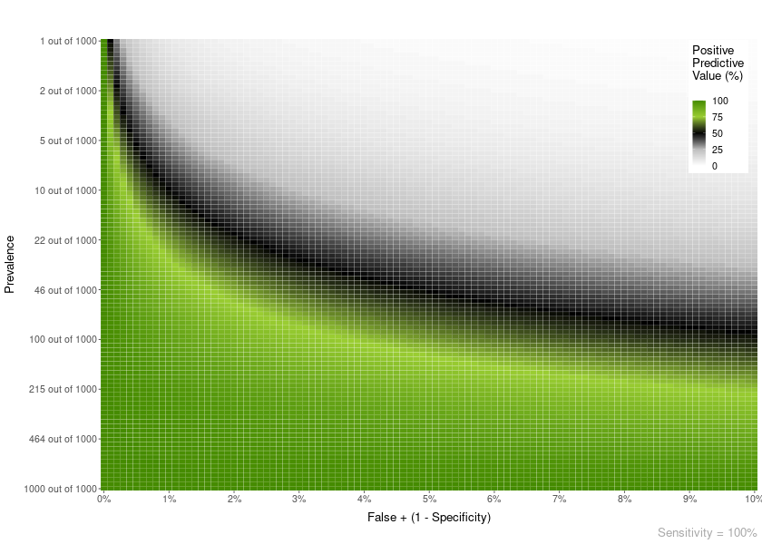
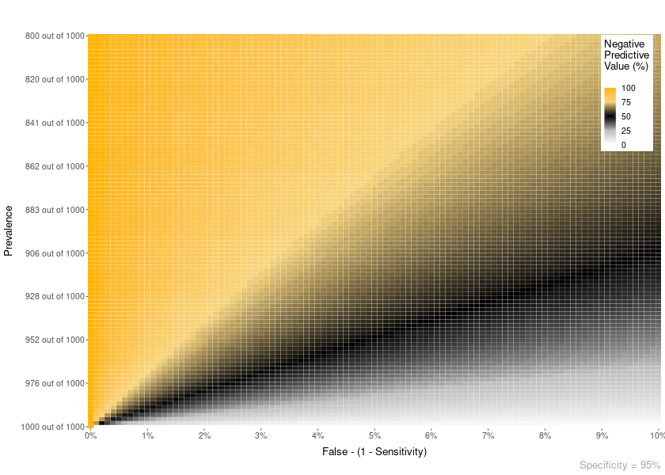
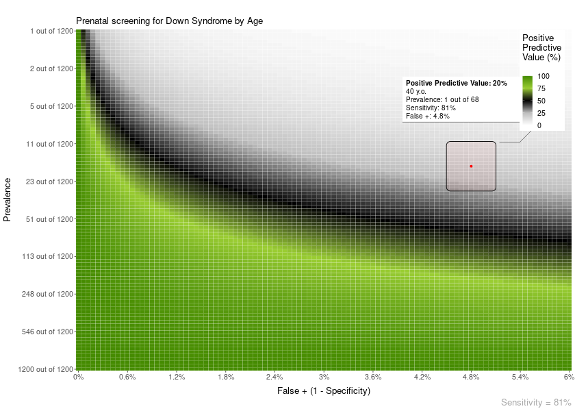
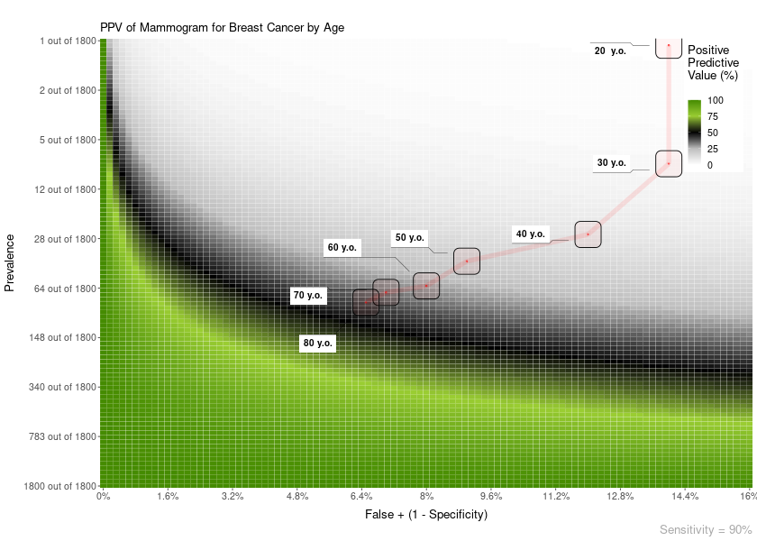
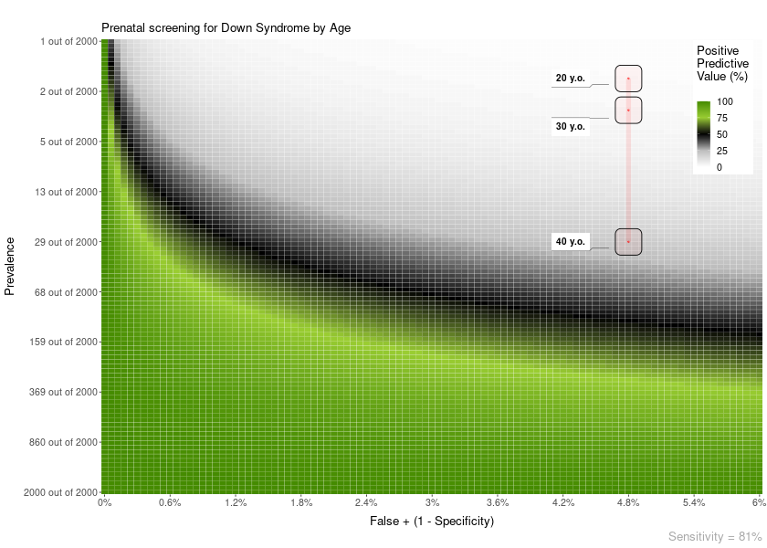
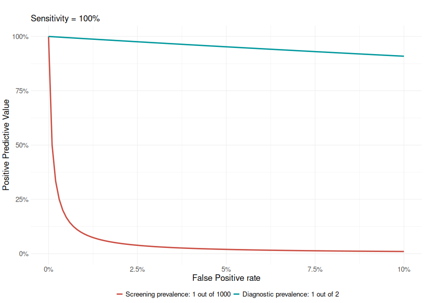

# Bayesian reasoning

<!-- badges: start -->

<!-- badges: end -->

------------------------------------------------------------------------

## Bayesian reasoning in medical contexts

This package includes a few functions to plot and help understand
Positive and Negative Predictive Values, and their relationship with
Sensitivity, Specificity and Prevalence.

-   The **Positive Predictive** Value of a medical test is the
    probability that a positive result will mean having the disease.
    Formally p(Disease|+)
-   The **Negative Predictive** Value of a medical test is the
    probability that a negative result will mean **not** having the
    disease. Formally p(Healthy|-)

The BayesianReasoning package has three main functions:

-   **PPV\_heatmap()**: Plot heatmaps with PPV or NPV values for the
    given test and disease parameters.
-   **PPV\_diagnostic\_vs\_screening()**: Plots the difference between
    the PPV of a test in a diagnostic context (very high prevalence; or
    a common study sample, e.g. ~50% prevalence) versus a screening
    context (lower prevalence).
-   **min\_possible\_prevalence()**: Calculates how high should the
    prevalence of a disease be to reach a desired PPV given certain test
    parameters.

------------------------------------------------------------------------

If you want to install the package can use:
`remotes::install_github("gorkang/BayesianReasoning")`. Please report
any problems you find in the [Issues Github
page](https://github.com/gorkang/BayesianReasoning/issues).

There is a [shiny app
implementation](https://gorkang.shinyapps.io/BayesianReasoning/) with
most of the main features available.

------------------------------------------------------------------------

## PPV\_heatmap()

Plot heatmaps with PPV or NPV values for a given specificity and a range
of Prevalences and FP or FN (1 - Sensitivity). The basic parameters are:

-   min\_Prevalence: Min prevalence in y axis. “min\_Prevalence out of
    y”  
-   max\_Prevalence: Max prevalence in y axis. “1 out of
    max\_Prevalence”  
-   Sensitivity: Sensitivity of the test  
-   max\_FP: FP is 1 - specificity. The x axis will go from FP = 0% to
    max\_FP  
-   Language: “es” for Spanish or “en” for English

<!-- -->

    PPV_heatmap(min_Prevalence = 1,
                max_Prevalence = 1000, 
                Sensitivity = 100, limits_Specificity = c(90, 100),
                Language = "en")

------------------------------------------------------------------------

### NPV

You can also plot an NPV heatmap with PPV\_NPV = “NPV”.

    PPV_heatmap(PPV_NPV = "NPV",
                min_Prevalence = 800, max_Prevalence = 1000, 
                Specificity = 95, limits_Sensitivity = c(90, 100),
                Language = "en")

------------------------------------------------------------------------

### Area overlay

You can add different types of overlay to the plots.

For example, an area overlay showing the point PPV for a given
prevalence and FP or FN:

    PPV_heatmap(min_Prevalence = 1, max_Prevalence = 1200, 
                Sensitivity = 81, 
                limits_Specificity = c(94, 100),
                label_subtitle = "Prenatal screening for Down Syndrome by Age",
                overlay = "area",
                overlay_labels = "40 y.o.",
                overlay_position_FP = 4.8,
                overlay_prevalence_1 = 1,
                overlay_prevalence_2 = 68)

The area plot overlay can show more details about how the calculation of
PPV/NPV is performed:

    PPV_heatmap(min_Prevalence = 1, max_Prevalence = 1200, 
                Sensitivity = 81, 
                limits_Specificity = c(94, 100),
                label_subtitle = "Prenatal screening for Down Syndrome by Age", 
                overlay_extra_info = TRUE,
                overlay = "area",
                overlay_labels = "40 y.o.",
                overlay_position_FP = 4.8,
                overlay_prevalence_1 = 1,
                overlay_prevalence_2 = 68)

### Line overlay

Also, you can add a line overlay highlighting a range of prevalences and
FP. This is useful, for example, to show how the PPV of a test changes
with age:

    PPV_heatmap(min_Prevalence = 1, max_Prevalence = 1800, 
                Sensitivity = 90, 
                limits_Specificity = c(84, 100),
                label_subtitle = "PPV of Mammogram for Breast Cancer by Age",
                overlay = "line", 
                overlay_labels = c("80 y.o.", "70 y.o.", "60 y.o.", "50 y.o.", "40 y.o.", "30 y.o.", "20  y.o."),
                overlay_position_FP = c(6.5, 7, 8, 9, 12, 14, 14),
                overlay_prevalence_1 = c(1, 1, 1, 1, 1, 1, 1),
                overlay_prevalence_2 = c(22, 26, 29, 44, 69, 227, 1667))

------------------------------------------------------------------------

Another example. In this case, the FP is constant across age:

    PPV_heatmap(min_Prevalence = 1, max_Prevalence = 2000, Sensitivity = 81, 
                limits_Specificity = c(94, 100),
                label_subtitle = "Prenatal screening for Down Syndrome by Age",
                overlay = "line",
                overlay_labels = c("40 y.o.", "30 y.o.", "20 y.o."),
                overlay_position_FP = c(4.8, 4.8, 4.8),
                overlay_prevalence_1 = c(1, 1, 1),
                overlay_prevalence_2 = c(68, 626, 1068))

------------------------------------------------------------------------

## PPV\_diagnostic\_vs\_screening()

In scientific studies developing a new test for the early detection of a
medical condition, it is quite common to use a sample where 50% of
participants has a medical condition and the other 50% are normal
controls. This has the unintended effect of maximizing the PPV of the
test.

This function shows a plot with the difference between the PPV of a
diagnostic context (very high prevalence; or a common study sample,
e.g. ~50% prevalence) versus that of a screening context (lower
prevalence).

    PPV_diagnostic_vs_screening(max_FP = 10, 
                                Sensitivity = 100, 
                                prevalence_screening_group = 1000, 
                                prevalence_diagnostic_group = 2)

------------------------------------------------------------------------

## min\_possible\_prevalence()

Imagine you would like to use a test in a population and want to have a
98% PPV. That is, IF a positive result comes out in the test, you would
like a 98% certainty that it is a true positive.

How high should the prevalence of the disease be in that group?

    min_possible_prevalence(Sensitivity = 100, 
                            FP_test = 0.1, 
                            min_PPV_desired = 98)

> To reach a PPV of 98 when using a test with 100 % Sensitivity and 0.1
> % False Positive Rate, you need a prevalence of at least 1 out of 21

------------------------------------------------------------------------

Another example, with a very good test, and lower expectations:

    min_possible_prevalence(Sensitivity = 99.9, 
                            FP_test = .1, 
                            min_PPV_desired = 70)

> To reach a PPV of 70 when using a test with 99.9 % Sensitivity and 0.1
> % False Positive Rate, you need a prevalence of at least 1 out of 429

------------------------------------------------------------------------
