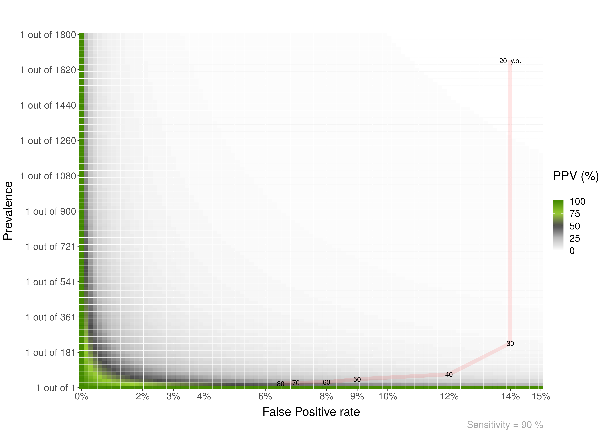

# Bayesian reasoning in medical contexts

This repository includes a few functions to plot and help understand Positive Predictive Values, and their relationship with Sensitivity, Specificity and Prevalence.  


## PPV_heatmap()

Plot heatmaps with PPV values for a given specificity and a range of Prevalences and FP. The basic parameters are:

* Max_Prevalence: Max prevalence in y axis. "1 out of Max_Prevalence"
* Sensitivity: Sensitivity of the test. 
* Max_FP: FP is 1 - specificity. The x axis will go from FP = 0% to Max_FP
* Language: "es" for Spanish or "en" for English  


``` r 

PPV_heatmap(Max_Prevalence = 1000, 
            Sensitivity = 100, 
            Max_FP = 2, 
            Language = "en")
            
```  


  


--- 

You can add an overlay to the plots. For example:

``` r 

PPV_heatmap(Max_Prevalence = 1800, Sensitivity = 90, Max_FP = 15, 
                label_subtitle = "PPV of Mammogram for Breast Cancer by Age",
                save_plot = TRUE, Language = "en", 
                overlay = TRUE, 
                overlay_labels = c("80", "70", "60", "50", "40", "30", "20  y.o."),
                overlay_position_FP = c(7, 8, 9, 12, 14, 14),
                overlay_position_Prevalence = c(26, 29, 44, 69, 227, 1667))
                
```

  

---   


## PPV_diagnostic_vs_screening

To show a plot with the difference between the PPV of a diagnostic context (or a common study sample ~50%) versus that of a screening context:  

``` r 

PPV_diagnostic_vs_screening(Max_FP = 10, 
                            Sensitivity = 100, 
                            prevalence_screening_group = 1000, 
                            prevalence_diagnostic_group = 3)
                            
```  


